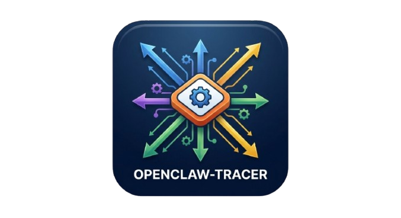
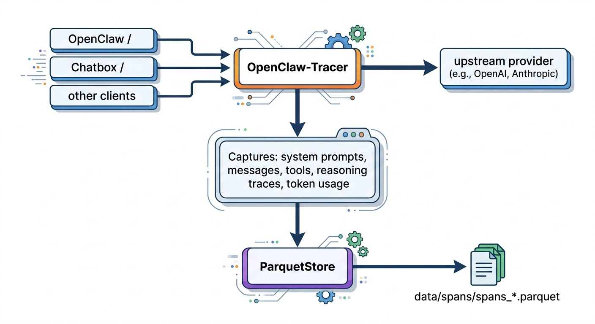

# OpenClaw-Tracer


OpenClaw-Tracer is a lightweight LLM data collection and tracing service for **OpenClaw** and other agent/LLM systems, built on LiteLLM. It sits in front of your agents as an OpenAI-compatible proxy, automatically capturing rich conversation and trace data (reasoning, tool calls, token usage, latency, etc.) for SFT/RL training and observability.


## Features

- **Universal LLM support**: Works with OpenAI, Anthropic, Azure, Google, AWS Bedrock, vLLM, TGI, and more via LiteLLM
- **Rich trace & conversation capture**: Captures system prompts, multi-turn conversations, tool calls, reasoning traces, and token usage
- **Time‑sharded Parquet storage**: Stores data in Parquet format with automatic time‑based file rotation
- **OpenAI‑compatible API**: Drop‑in replacement for any OpenAI SDK client
- **Docker‑friendly deployment**: Simple to run locally or in production with Docker / Docker Compose
- **Configurable buffering**: Tune buffering for immediate or batched writes depending on your workload

## Architecture

```
OpenClaw / Chatbox / other clients → OpenClaw-Tracer → upstream provider
                                              ↓
                                      Captures: system prompts, messages, tools,
                                                reasoning traces, token usage
                                              ↓
                                      ParquetStore → data/spans/spans_*.parquet
```

## Quick Start

### Option 1: Python (Recommended for Development)

```bash
# Create environment
micromamba create -n OpenClaw-Tracer python=3.10 -y
micromamba activate OpenClaw-Tracer

# Install dependencies
pip install -r requirements.txt

# Configure models (edit config/models.json with your API keys)
# Then start the proxy
python scripts/serve.py --config config/models.json --output-dir ./data
```

The proxy will start on `http://localhost:43886/v1`.

### Option 2: Docker (Recommended for Production)

```bash
# Build the image
docker build -t openclaw-tracer:latest .

# Run the container
docker run -d \
  --name openclaw-tracer \
  -p 43886:43886 \
  -v $(pwd)/config:/app/config:ro \
  -v $(pwd)/data:/app/data \
  -v $(pwd)/logs:/app/logs \
  openclaw-tracer:latest
```

### Option 3: Docker Compose

```bash
# Start with default settings
docker-compose up -d

# Or with custom environment variables
export HOST_PORT=43886
export BUFFER_SIZE=1
export TIME_WINDOW_MINUTES=30
docker-compose up -d
```

## Configuration

Create `config/models.json` with your model configurations:

```json
{
    "model_list": [
        {
            "model_name": "gpt-4",
            "litellm_params": {
                "model": "openai/gpt-4",
                "api_key": "env:OPENAI_API_KEY"
            }
        },
        {
            "model_name": "claude-3-5-sonnet",
            "litellm_params": {
                "model": "anthropic/claude-3-5-sonnet-20241022",
                "api_key": "env:ANTHROPIC_API_KEY"
            }
        },
        {
            "model_name": "local-vllm",
            "litellm_params": {
                "model": "hosted_vllm/meta-llama/Meta-Llama-3-8B-Instruct",
                "api_base": "http://localhost:8000/v1"
            }
        }
    ]
}
```

### Environment Variables

#### Basic Configuration

| Variable | Default | Description |
|----------|---------|-------------|
| `PORT` | `43886` | Proxy server port |
| `BUFFER_SIZE` | `1` | Records to buffer before writing (1 = immediate) |
| `TIME_WINDOW_MINUTES` | `30` | Minutes between creating new Parquet files |
| `FLUSH_INTERVAL_SECONDS` | `1800` | Periodic flush interval in seconds (0 = disabled) |

#### Model Configuration (Environment-based)

| Variable | Required | Description |
|----------|----------|-------------|
| `TARGET_MODEL` | Yes | Target model name for training |
| `ORIGIN_MODEL` | Yes | Original upstream model name |
| `API_MODE` | Yes | Original API type (e.g., `openai`, `anthropic`, `custom`) |
| `API_URL` | No | Custom API base URL (overrides default) |
| `ACCESS_KEY` | Yes | API access key |

#### Batch Mode (Rolling Window)

| Variable | Required | Description |
|----------|----------|-------------|
| `TRAJECTORY_BUFFER_SIZE` | No | Total records to retain (0 = disabled, enables batch mode) |

When `TRAJECTORY_BUFFER_SIZE` is set, data is stored in rolling batches. Old data is automatically deleted when the limit is exceeded.

**Example using environment variables:**

```bash
export TARGET_MODEL="my-model"
export ORIGIN_MODEL="gpt-4"
export API_MODE="openai"
export API_URL="https://api.example.com/v1"
export ACCESS_KEY="sk-xxx"
export BUFFER_SIZE=100
export TRAJECTORY_BUFFER_SIZE=10000
export FLUSH_INTERVAL_SECONDS=300

python scripts/serve.py
```

## Usage

### Sending Requests

Use any OpenAI-compatible client:

```bash
curl http://localhost:43886/v1/chat/completions \
  -H "Content-Type: application/json" \
  -d '{
    "model": "gpt-4",
    "messages": [{"role": "user", "content": "Hello!"}]
  }'
```

```python
from openai import OpenAI

client = OpenAI(
    base_url="http://localhost:43886/v1",
    api_key="dummy"  # Not used but required by SDK
)

response = client.chat.completions.create(
    model="gpt-4",
    messages=[{"role": "user", "content": "Hello!"}]
)
```

### Viewing Collected Data

```bash
# Show statistics
python scripts/show_stats.py --output-dir ./data

# View latest records
python scripts/show_spans.py --num 5

# Inspect specific file
python scripts/show_file.py data/spans/spans_20260310_143000.parquet --limit 10
```

## Data Structure

Collected data is stored in `data/spans/spans_YYYYMMDD_HHMMSS.parquet` with the following structure:

| Column | Description |
|--------|-------------|
| `name` | Span name (e.g., "llm.completion") |
| `start_time` | Request start time (Unix timestamp) |
| `end_time` | Request end time |
| `attributes` | JSON string containing all data |
| `rollout_id` | Unique rollout identifier |
| `attempt_id` | Unique attempt identifier |

### Attributes JSON Structure

```json
{
  "llm.model": "gpt-4",
  "llm.request.system": "You are a helpful assistant...",
  "llm.request.messages": "[{\"role\": \"user\", \"content\": \"...\"}]",
  "llm.request.tools": "[...]",
  "llm.response.content": "Response text...",
  "llm.response.tool_calls": "[...]",
  "llm.response.reasoning": "Thinking process...",
  "llm.usage.prompt_tokens": 20,
  "llm.usage.completion_tokens": 100,
  "llm.usage.total_tokens": 120
}
```

## Docker Advanced

### Building with Custom Tag

```bash
docker build -t your-registry/openclaw-tracer:v1.0.0 .
```

### Running with Custom Settings

```bash
docker run -d \
  --name openclaw-tracer \
  -p 8080:43886 \
  -v $(pwd)/config:/app/config:ro \
  -v $(pwd)/data:/app/data \
  -v $(pwd)/logs:/app/logs \
  -e PORT=43886 \
  -e BUFFER_SIZE=10 \
  -e TIME_WINDOW_MINUTES=60 \
  your-registry/openclaw-tracer:v1.0.0
```

### Using Docker Compose with Environment File

Create `.env`:
```
HOST_PORT=43886
PORT=43886
BUFFER_SIZE=1
TIME_WINDOW_MINUTES=30
```

Then start:
```bash
docker-compose up -d
```

### Viewing Logs

```bash
# Container logs
docker logs -f openclaw-tracer

# HTTP access logs
tail -f logs/http.jsonl

# Diagnostic logs
tail -f logs/diagnostic.log
```

### Stopping the Container

```bash
# Stop and remove container
docker stop openclaw-tracer
docker rm openclaw-tracer

# Or with docker-compose
docker-compose down
```

## Data Export for Training

Export collected data for TRL or HuggingFace datasets:

```python
import pandas as pd

# Load spans
df = pd.read_parquet("data/spans/spans_20260310_143000.parquet")

# Convert to training format
# (See docs/USAGE.md for detailed export instructions)
```

## Health Check

The Docker container includes a health check:

```bash
# Check health status
docker inspect --format='{{.State.Health.Status}}' openclaw-tracer

# Manual health check
curl http://localhost:43886/v1/models
```

## Troubleshooting

### Proxy not starting
- Check that `config/models.json` exists and is valid
- Verify API keys are set in environment variables

### No data being collected
- Check logs: `docker logs openclaw-tracer`
- Verify BUFFER_SIZE setting (1 = immediate write)
- Ensure requests are being sent to the correct port

### Permission errors
- Ensure `data/` and `logs/` directories are writable
- Check volume mount permissions in Docker

## Roadmap / TODO

### Multi-Turn Conversation Tracking

**Current Status**: Each LLM request is captured independently with unique identifiers. There is no built-in mechanism to correlate multiple requests that belong to the same agent session/conversation.

**Planned Features**:
- **Session Management**: Track multiple LLM calls within a single agent conversation session
  - Support for `traceparent` header (OpenTelemetry standard) for distributed tracing compatibility
  - Support for custom `X-Session-ID` header for SDK-based session management
  - Server-side session management with cookie-based tracking for SDK-less scenarios
  - Automatic session timeout and cleanup (configurable, default 30 minutes)

- **Conversation Reconstruction**: Query and merge all spans belonging to a session
  - New query method: `store.get_session_spans(session_id)` to retrieve all related LLM calls
  - Automatic reconstruction of conversation flow using `sequence_id` ordering
  - Export complete conversations as training examples (multi-turn dialogue format)
  - Visual conversation tree visualization for debugging complex agent workflows

- **Enhanced Metadata**: Additional session-level information
  - Session start/end timestamps
  - Total token usage per session
  - Number of turns in the conversation
  - Session metadata (user ID, agent ID, task type, etc.)

**Use Cases**:
- Multi-turn agent conversations where the agent makes multiple LLM calls
- Tool-using agents that need to track LLM calls interleaved with tool executions
- Conversational analysis and pattern recognition
- Training on complete conversation episodes rather than isolated turns

---

### Distributed Deployment Support

**Current Status**: Single-instance deployment only. Session state (if implemented) would be stored in-memory, making it incompatible with multi-instance deployments behind load balancers.

**Planned Features**:
- **Stateless Architecture**: Remove dependency on in-memory session state
  - All session context passed via request headers (client-managed sessions)
  - Support for external session stores (Redis, PostgreSQL, etcd)
  - Configurable session backend via environment variables

- **Scalable Storage**: Distributed Parquet file management
  - Support for S3-compatible object storage (AWS S3, MinIO, GCS, Azure Blob)
  - Automatic file partitioning by date/hour for efficient querying
  - Optional write-ahead log for crash recovery
  - Support for columnar storage formats (Delta Lake, Apache Iceberg)

- **Load Balancer Compatibility**: Deploy multiple instances behind a load balancer
  - Health check endpoint with readiness/liveness probes
  - Graceful shutdown with in-flight request completion
  - Request draining for zero-downtime deployments
  - Session affinity (optional) for cookie-based sessions

- **Observability**: Production-ready monitoring and logging
  - OpenTelemetry integration for distributed tracing
  - Prometheus metrics export (request count, latency, error rates)
  - Structured logging with JSON output
  - Integration with logging aggregators (ELK, Loki, CloudWatch)

- **High Availability**: Redundancy and failover mechanisms
  - Leader election for singleton tasks (log rotation, cleanup jobs)
  - Hot-standby instances with automatic failover
  - Database connection pooling and circuit breakers
  - Retry logic with exponential backoff for upstream API calls

**Deployment Targets**:
- Kubernetes with Helm charts for easy deployment
- Docker Swarm mode for multi-host deployments
- AWS ECS/GCP Cloud Run/Azure Container Instances

## License

MIT License - see LICENSE file for details.

## Contributing

Contributions are welcome! Please feel free to submit a Pull Request.
